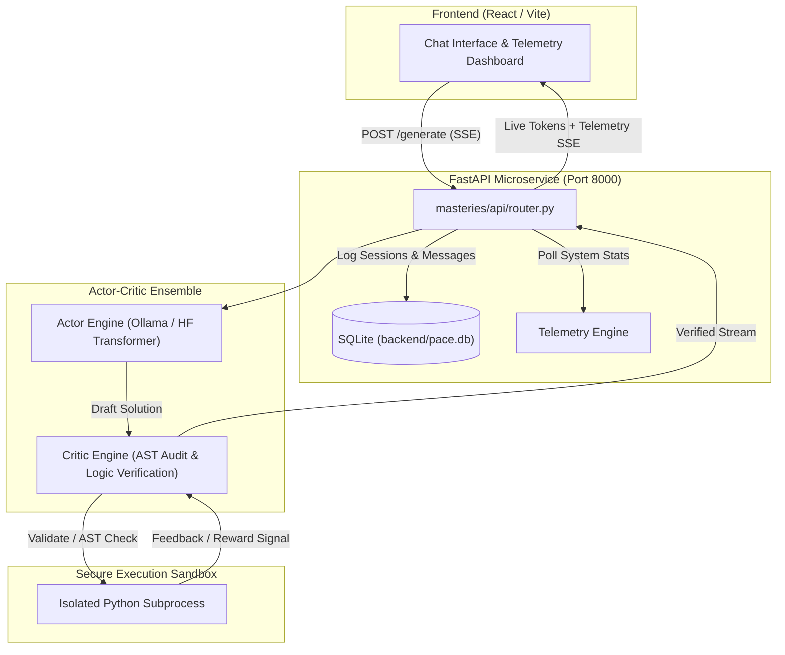

# 🚀 PACE: Pipelined Actor-Critic Ensemble

> **High-Performance Heterogeneous Micro-Agent AI Microservice for Local Code Generation, Document Literacy & Research Synthesis**


---

## 📌 Core Thesis & Executive Summary

An ensemble of specialized micro-models can eliminate AI hallucinations and outperform massive monolithic LLMs through a rigorous **Actor-Critic validation loop**. 

**PACE (Pipelined Actor-Critic Ensemble)** is engineered from the ground up to operate within strict hardware constraints while delivering high-integrity AI model inference, interactive code generation, document literacy synthesis, and research exploration on consumer hardware.

- **Target Hardware**: NVIDIA RTX 4060 (8GB VRAM), 16GB RAM / CPU Fallback
- **Core Constraint**: Never exceed 8GB VRAM; hot-swap models dynamically
- **Scope**: Engineering Microservice Platform + Published Research System

By pairing an **Actor model** (responsible for initial token generation) with a **Critic model** (responsible for AST analysis, safety auditing, and iterative logical correction), PACE guarantees higher quality code outputs and validated responses while maintaining real-time performance telemetry.

---

## 🗺 Table of Contents

- [Core Thesis & Executive Summary](#-core-thesis--executive-summary)
- [Overview & Key Features](#-overview--key-features)
- [Architecture & Workflow](#-architecture--workflow)
- [Masteries Overview (Domain Experts)](#-masteries-overview-domain-experts)
- [System Components & Repository Map](#-system-components--repository-map)
- [Security Architecture](#-security-architecture)
- [Hardware & Telemetry Engine](#-hardware--telemetry-engine)
- [Hardware Budget Analysis](#-hardware-budget-analysis)
- [Installation & Setup](#-installation--setup)
- [API Reference](#-api-reference)
- [Docker & Containerized Deployment](#-docker--containerized-deployment)
- [Author & Acknowledgments](#-author--acknowledgments)

---

## ✨ Overview & Key Features

- 🎭 **Actor-Critic Ensemble Pipeline**: Streamlined generation with dynamic iterative self-correction loops where Critic inspects Actor output before completion.
- ⚡ **Local Hardware Optimization**: Efficiently schedules VRAM and RAM allocations; integrates natively with local **Ollama** models (e.g., `llama3.2:1b`) and PyTorch/HuggingFace Transformers.
- 🔒 **Isolated Subprocess Sandbox**: Executes LLM-generated code safely in non-blocking child processes with test harnesses and strict execution timeouts.
- 📊 **Real-Time Telemetry & Monitoring**: Live monitoring of VRAM usage, CPU/GPU load, Time-To-First-Token (TTFT), tokens-per-second (TPS), and total request latency via Server-Sent Events (SSE).
- 📄 **PDF & Document Literacy Engine**: Integrated PDF parsing, chunking, and contextual query processing using `PyMuPDF`.
- 🦀 **Rust-Powered Tokenization**: PyO3 Rust extensions for high-speed custom token handling.
- 💾 **SQLite History & Multi-Workspace Persistence**: Persistent conversation tracking and workspace state management stored in SQLite (`backend/pace.db`).
- 🎨 **Modern React / Vite Dashboard**: Dark & Light theme interface featuring live performance meters, speed mode selection (Pro vs. Fast), code highlighting, and session controls.

---

## 🏗 Architecture & Workflow

The PACE architecture operates via a decoupled microservice layout connecting the Frontend dashboard, FastAPI backend, Domain Masteries, Sandbox Execution Engine, and Hardware Telemetry System.



### Request Flow Modes:
- **Fast Mode (Latency-Optimized)**: Tokenize $\rightarrow$ Load Actor $\rightarrow$ Inference $\rightarrow$ Return Response stream.
- **Pro Mode (Accuracy-Optimized)**: Tokenize $\rightarrow$ Load Actor $\rightarrow$ Generate initial code/text $\rightarrow$ Load Critic $\rightarrow$ Evaluate AST & logic $\rightarrow$ (If Fail: Inject Feedback into Prompt, Loop back to Actor. Max 5 iterations) $\rightarrow$ Return verified output.

---

## 🎯 Masteries Overview (Domain Experts)

The system is divided into three domain experts ("Masteries"). Each Mastery consists of a paired **Actor** (generator) and **Critic** (validator), forming a self-correcting loop.

| Mastery | Actor (Generator) | Critic (Validator) | Objective Verification |
|---|---|---|---|
| 💻 **Coding** | Writes code from prompt/spec | Checks syntax, logic, test-pass probability | Unit tests execute and pass in isolated sandbox |
| 📖 **Literacy** | Summarizes, rewrites, answers from local text | Checks factual consistency, hallucination | Claim-to-source sentence mapping (NLI) |
| 🔬 **Research** | Synthesizes live web/academic sources into reviews | Verifies citation existence and claim accuracy | Regex checks citation IDs; NLI verifies abstract match |

**Critical Principle:** Each Critic has an objective verification mechanism to ensure factual and logical validity.

---

## 📂 System Components & Repository Map

```
PACE/
├── backend/                  # FastAPI main application & SQLite DB storage
│   ├── main.py               # FastAPI entry point & CORS configuration
│   └── pace.db               # Persistent SQLite database
├── core/                     # Core system modules
│   ├── sandbox/              # Subprocess execution harness for untrusted code
│   │   └── executor.py       # Isolated Python script runner with timeouts
│   ├── security/             # Input validation and code watermarking
│   ├── tokenizers/           # Custom Rust tokenization bindings (Cargo & PyO3)
│   └── vram_scheduler/       # Dynamic VRAM memory management and allocation
├── frontend/                 # React + Vite UI Dashboard
│   ├── src/
│   │   ├── components/       # ChatInterface, HardwareMonitor, Sidebar, etc.
│   │   ├── ThemeContext.jsx  # Dark/Light mode theme state
│   │   └── styles.css        # Custom Vanilla CSS design system
│   ├── package.json
│   └── vite.config.js
├── masteries/                # Domain-specific engine modules
│   ├── api/                  # FastAPI routers, endpoints & Pydantic schemas
│   │   ├── router.py         # Main routes (/generate, /telemetry, /conversations, /upload)
│   │   └── schemas.py        # API Request/Response schemas
│   ├── coding/               # Coding Mastery Engine
│   │   └── inference/        # Actor-Critic Orchestrators (v4), generate & predict
│   ├── literacy/             # Technical document processing & corpus handling
│   ├── research/             # Literature synthesis & attention analysis engine
│   └── services/             # Telemetry, Database, Ollama, PDF Parser, Chunker
├── infra/                    # Deployment & Infrastructure
│   ├── docker/               # Dockerfiles (backend, sandbox, frontend) & docker-compose.yml
│   └── setup_cuda.sh         # CUDA environment setup helper script
├── pyproject.toml            # Project setup & metadata
├── requirements.txt          # Python dependencies
└── README.md                 # Project Documentation
```

---

## 🔒 Security Architecture

| Layer | Threat | Mitigation |
|---|---|---|
| **Input Sanitization** | Prompt injection, oversized payloads | Max token limits, regex filters, payload size caps |
| **Model Runtime** | Adversarial inputs causing OOM | Input caps, execution timeouts, VRAM watchdog thread |
| **API Access** | Quota abuse, unauthorized requests | CORS domain policies, rate limiting, request validation |
| **Code Execution** | Arbitrary code execution | **Isolated Sandboxing**: Isolated Python subprocess with read/write temp isolation, CPU timeouts |

---

## 📈 Hardware & Telemetry Engine

The PACE Telemetry Engine (`masteries/services/telemetry.py`) provides real-time system monitoring during inference:

- **GPU Metrics**: Device identification, allocated VRAM (MB), total VRAM (MB), VRAM usage %, GPU utilization.
- **Host Metrics**: CPU utilization %, RAM usage (MB).
- **Inference Metrics**: Latency (ms), Time-To-First-Token (TTFT in ms), execution duration (seconds), tokens generated, generation speed (Tokens/Sec).

---

## 💡 Hardware Budget Analysis (RTX 4060 8GB)

| Component | Fast Tier (GB) | Pro Tier (GB) |
|---|---|---|
| **Actor Model** (~3B params, FP16) | ~4.5 | ~4.5 |
| **Critic Model** (~1.5B params, FP16) | — | ~2.5 |
| **Activation Cache** (max sequence) | ~0.8 | ~0.8 |
| **PyTorch CUDA Overhead** | ~1.2 | ~1.2 |
| **System / Display Reserve** | ~0.5 | ~0.5 |

> **Key Insight**: PyTorch CUDA context initialization creates an initial ~1.2GB floor. Hot-swapping models ensures Peak VRAM usage remains strictly under the 8GB limit.

---

## ⚡ Installation & Setup

### Prerequisites
- **Python**: `>= 3.10`
- **Node.js**: `>= 18.0` (for Frontend)
- **NVIDIA GPU** *(Optional, recommended)*: CUDA 12.1+ for PyTorch GPU acceleration.
- **Ollama** *(Optional, recommended)*: Installed locally with `llama3.2:1b` or compatible model pulled.

---

### 1. Clone & Setup Python Environment

```bash
git clone https://github.com/KiritoTempest175/PACE.git
cd PACE

# Create virtual environment
python -m venv .venv

# Activate virtual environment
# Windows:
.venv\Scripts\activate
# Linux/macOS:
source .venv/bin/activate
```

### 2. Install PyTorch & Dependencies

For CUDA-accelerated GPU support (RTX series or similar):
```bash
pip install torch torchvision torchaudio --index-url https://download.pytorch.org/whl/cu121
```

Install standard project dependencies:
```bash
pip install -r requirements.txt
pip install -e .
```

---

### 3. Run Backend Server

```bash
# Start FastAPI backend via uvicorn
uvicorn backend.main:app --host 0.0.0.0 --port 8000 --reload
```
The API documentation will be available at [http://localhost:8000/docs](http://localhost:8000/docs).

---

### 4. Run Frontend Dashboard

In a separate terminal window:
```bash
cd frontend
npm install
npm run dev
```
Open [http://localhost:5173](http://localhost:5173) in your browser to access the PACE dashboard.

---

## 📡 API Reference

| Endpoint | Method | Description |
| :--- | :--- | :--- |
| `/health` | `GET` | Health check endpoint returning `{ "status": "healthy" }` |
| `/telemetry` | `GET` | Returns real-time GPU/CPU/RAM hardware utilization & performance stats |
| `/generate` | `POST` | Primary stream endpoint: accepts prompt, runs Actor-Critic pipeline, streams SSE events |
| `/predict` | `POST` | Direct code generation endpoint (returns single batch prediction response) |
| `/upload` | `POST` | Upload PDF file for text extraction, chunking, and literacy parsing |
| `/conversations` | `GET` | List all historical chat sessions stored in SQLite |
| `/conversations` | `POST` | Create a new conversation session |
| `/conversations/{id}` | `GET` | Fetch specific conversation session and message history |
| `/conversations/{id}` | `DELETE`| Remove conversation session |

---

## 🐳 Docker & Containerized Deployment

PACE includes a containerized multi-service setup orchestrated by Docker Compose:

- **`backend`**: FastAPI service running python backend services (Port `8000`).
- **`sandbox`**: Resource-restricted isolated container (`256M RAM` limit, `0.5 CPU` cap, no external network access) for safe execution of untrusted code.
- **`frontend`**: Production build of Vite/React served via Nginx (Port `5173`).

### Launch with Docker Compose:

```bash
cd infra/docker
docker compose up --build -d
```

To stop containers:
```bash
docker compose down
```

---

## 👤 Author & Acknowledgments

- **Author**: Muhammad Huzaifa Zaman ([huzaifazaman38@gmail.com](mailto:huzaifazaman38@gmail.com))
- **Repository**: [KiritoTempest175/PACE](https://github.com/KiritoTempest175/PACE)
- **License**: Open Source Project
