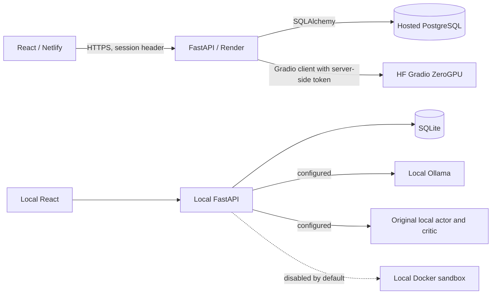

# PACE — Pipelined Actor-Critic Ensemble

PACE is a work-in-progress AI productivity workspace for coding, PDF literacy and research exploration. Its React/Vite frontend communicates with a FastAPI application that stores anonymous-session conversations and extracted PDF text in SQLite (local) or hosted PostgreSQL. Inference is provided through **one of three explicit modes**, selected via configuration.

The hosted Hugging Face service uses a **single pretrained instruction model**, not the original independently trained actor-critic models. The `local` provider uses the original Python actor and critic classes and only describes an answer as independently reviewed if both models actually execute. `ollama` is a local single-model option with an optional second-pass review. No published quality metric or factual verification is claimed.

## Features and limitations

| Feature | Implementation status |
|---|---|
| Coding workspace | Real provider inference; optional restricted Docker Python exercise runner on local development only |
| PDF literacy | Strict upload validation, extracted-text persistence, bounded keyword excerpts, conversation/document association; not semantic RAG |
| Research workspace | Real model-generated exploratory responses, **without** verified source retrieval or citations |
| Actor / critic | Original local actors/critics callable in `AI_PROVIDER=local` and Review mode; not benchmarked in this patch |
| Hugging Face ZeroGPU | Gradio generator and single pretrained model; Review uses the **same** model twice; quota and hardware restrictions apply |
| Ollama | Local HTTP streaming from configured model; Review uses the same model twice |
| Persistence | SQLite locally; PostgreSQL via Neon (or equivalent) on Render; anonymous bearer session, **not accounts** |
| Realtime telemetry | API-host CPU/RAM/GPU measurements if available; not ZeroGPU telemetry or browser GPU |
| Rust tokenizer | No working Rust PyO3 extension found in the inspected upstream tree; configurable approximate Python fallback; model tokenizer used for actual inference |
| Security | UUID PDF paths, parsed PDFs, page/text limits, request-body ceiling, limited CORS, rate limits, safe errors, session-owned reads, opt-in isolated execution |
| Full production verification | **Not complete.** Requires integration/deployment tests and authorization to deploy services. |

## Architecture


```mermaid
flowchart LR
    Client[React / Netlify] -->|HTTPS, session header| Api[FastAPI / Render]
    Api -->|SQLAlchemy| Neon[(Hosted PostgreSQL)]
    Api -->|Gradio client with server-side token| HF[HF Gradio ZeroGPU]
    Local[Local React] --> ApiLocal[Local FastAPI]
    ApiLocal --> Sqlite[(SQLite)]
    ApiLocal -->|configured| Ollama[Local Ollama]
    ApiLocal -->|configured| Models[Original local actor and critic]
    ApiLocal -.->|disabled by default| Sandboxed[Local Docker sandbox]
```

## Repository layout

- `frontend/`: accessible workspace UI and reusable controls, Vite build and tests.
- `backend/`: FastAPI entrypoint, request-body protection, deployment dependencies.
- `masteries/api/`: validated HTTP contracts and per-session endpoints.
- `masteries/services/`: real model provider adapters, PDF ingestion, persistence, tokenizer fallback and context retrieval.
- `masteries/*/training/`: upstream local actor/critic classes, retained in the original repository.
- `masteries/*/inference/`: compatibility generator entrypoints; no fabricated answers.
- `core/`: configuration and sandbox.
- `ai-service/`: separately deployable Hugging Face Gradio Space.
- `docs/`: design, audit mapping, file changes, platform deployment instructions.

## Local setup

Python 3.10+ for FastAPI, Node 20+ for the React frontend; use Python 3.10.13 or 3.12.12 as supported by the selected ZeroGPU runtime in your Space. Do not commit local `.env` files.

```bash
cp .env.example .env
python -m venv .venv
# Activate the virtual environment for your operating system.
pip install -r backend/requirements.txt
uvicorn backend.main:app --reload --port 8000
```

In a separate terminal:

```bash
cd frontend
npm install
npm run dev
```

With `AI_PROVIDER=disabled` CRUD and PDF features work, but the model correctly returns an unavailable error. For actual local inference choose `AI_PROVIDER=ollama` and install/run the model referenced by `OLLAMA_MODEL`. For original actor/critic models choose `AI_PROVIDER=local` and install `requirements-local-ai.txt` together with a suitable PyTorch CPU/CUDA build. A local GPU with 8 GB VRAM may **not** run all original model variants simultaneously; choose smaller variants or sequential loading and benchmark independently.

For Compose run `docker compose up --build` with `.env` present. SQLite is stored in a persistent **local Docker volume**. Hosted Render must use a hosted database.

### Optional local sandbox

Execution is disabled by default and always disabled in production mode. For local trusted environments build the sandbox image, then set `ENVIRONMENT=development` and `SANDBOX_ENABLED=true` before running the FastAPI process on a machine with a Docker daemon.

```bash
docker build -f infra/docker/Dockerfile.sandbox -t pace-sandbox:local .
```

The runner has no network, no host mounts, drops capabilities, uses a read-only filesystem, unprivileged UID and CPU/memory/PID/time limits. The AST import filter is **not** a separate security boundary. Do not expose a Docker socket or local sandbox to an untrusted public service.

## API contract

| Endpoint | Behavior |
|---|---|
| `GET /health` | API process health and model configuration, not proof a remote model works |
| `GET /telemetry` | Current API-host performance counters |
| `GET/POST /conversations` | Session-scoped history |
| `GET/DELETE /conversations/{id}` | Session-scoped reads/deletes |
| `POST /upload` | PDF-only text ingestion, generated document ID, uploaded binary deleted |
| `DELETE /documents/{id}` | Deletes only a document owned by the caller's session |
| `POST /predict` | Complete result or explicit 503 on failure |
| `POST /generate` | Streaming SSE `init`, `token`, `done` OR `error` frames. After headers, failure uses an error event rather than 503. |
| `POST /sandbox/run` | Local-only isolated runner, opt-in; otherwise 503 |

All endpoints except `/` and `/health` require a client-generated random `X-PACE-Session` bearer token. Tokens allow access to their matching records; they do **not** establish a user identity. Treat them as secrets and avoid uploading sensitive documents before full authentication, data retention, privacy and backups are implemented.

## Tests

```bash
pip install -r requirements-dev.txt
pytest -q tests
python -m compileall -q backend core masteries ai-service
cd frontend && npm install && npm run lint && npm test && npm run build
```

**Build reproducibility gap:** The provided overlay cannot include a regenerated `frontend/package-lock.json`, because the test environment cannot reach the npm registry. The upstream lockfile is for a different package manifest and must not be reused. Generate a new lock with `npm install`, commit it, then change CI/Netlify/Docker build steps to `npm ci`. The Vite build and frontend component tests have not been executed in the current environment.

## Deployment

Refer to [docs/DEPLOYMENT.md](docs/DEPLOYMENT.md) for platform-specific settings, env tables and verification. The architecture is designed to fit zero-recurring-hosting-cost **quotas**, not zero operational limits. ZeroGPU eligibility and daily quotas can change. Render Free spins down and has ephemeral local storage. PostgreSQL persistence must be configured separately.

## Screenshot placeholders

- `docs/screenshots/workspace-light.png`
- `docs/screenshots/workspace-dark.png`
- `docs/screenshots/literacy-upload.png`
- `docs/screenshots/sandbox-local.png`
- `docs/screenshots/mobile.png`

These are placeholders, not screenshots of a verified deployed application.

## Security and scope disclosure

The 22 backend contract tests exercise selected security and persistence boundaries without external GPU/network calls. They do not establish universal correctness, formal container isolation, accessibility compliance, dependency safety, or actual GPU performance. No external deployment was performed by this delivery. For a list of remaining issues, consult [docs/AUDIT_MATRIX.md](docs/AUDIT_MATRIX.md).
